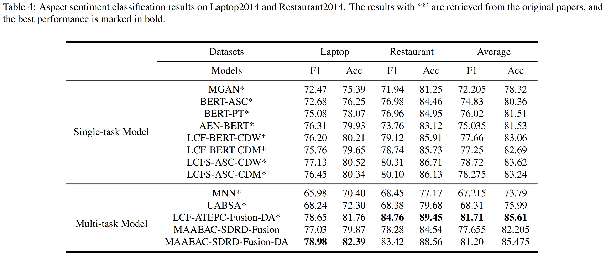

# MAAEAC

Codes for our manuscript draft: "Multi-task Learning with Multi-head Attention for Aspect Term Extraction and Aspect Sentiment Classification"

> MAAEAC,  a multi-task learning model with Multi-head Attention for Aspect Term Extraction and Aspect Sentiment Classification task


## Requirement

* Python >= 3.7
* PyTorch >= 1.0
* [pytorch-transformers](https://github.com/huggingface/pytorch-transformers) = 1.2.0
* spaCy >= 3.0  
* Set `use_bert_spc = True` to improve the APC performance while only APC is evaluated.

## Installation

    python -m spacy download en_core_web_lg

We use `en_ core_ web_lg` for more accurate results.

## Dataset
Download the SemEval dataset on: 
* [SemEval-2014 Task 4](https://alt.qcri.org/semeval2014/task4/)
* [SemEval-2015 Task 12](http://alt.qcri.org/semeval2015/task12/)
* [SemEval-2016 Task 5](http://alt.qcri.org/semeval2016/task5/)


## BERT Language Model Finetuning
### Preparing data for BERT Language Model Finetuning

We make use of two publicly available research datasets
for the domains laptops and restaurants:

* Amazon electronics reviews and metadata for filtering laptop reviews only:
    * Per-category files, both reviews (1.8 GB) and metadata (187 MB) - ask jmcauley to get the files, 
    check http://jmcauley.ucsd.edu/data/amazon/amazon_readme.txt
* Yelp restaurants dataset:
    * https://www.yelp.com/dataset/download (3.9 GB)
    * Extract review.json
    
### BERT language models finetuned on a specific domain

* [BERT-ADA Laptops](https://drive.google.com/file/d/1I2hOyi120Fwn2cApfVwjaOw782IGjWS8/view?usp=sharing)
* [BERT-ADA Restaurants](https://drive.google.com/file/d/1DmVrhKQx74p1U5c7oq6qCTVxGIpgvp1c/view?usp=sharing)
* [BERT-ADA Joint (Restaurant + Laptops)](https://drive.google.com/file/d/1LqscXdlzKxx7XPPcWXRGRwgM8agnH4kM/view?usp=sharing)

The models should be compatible with the [huggingface/pytorch-transformers](https://github.com/huggingface/pytorch-transformers) module version > 1.0.
The models are compressed with tar.xz and need to be decompressed before usage.

    @article{rietzler2019adapt,
       title={Adapt or Get Left Behind: Domain Adaptation through BERT Language Model Finetuning for Aspect-Target Sentiment Classification},
       author={Rietzler, Alexander and Stabinger, Sebastian and Opitz, Paul and Engl, Stefan},
       journal={arXiv preprint arXiv:1908.11860},
       year={2019}
    }

## Training
We use the configuration file to manage experiments setting.

Training in batches by experiments configuration file, refer to the [experiments.json](experiments.json) to manage experiments.

```sh
python train.py --config_path experiments.json
```

## Note
### Important scripts

* atepc_datasets/../*.dat: Preprocessed training and testing data.
* model/maaeac.py: The source code of MAAEAC model.
* utils/data_utils.py: Convert the examples to features and calculate the shortest syntactic dependence relative distance to target words via the syntax tree.

### Out of Memory

Since BERT models require a lot of memory. If the out-of-memory problem while training the model, here are the ways to mitigate the problem:
1. Reduce the training batch size ( train_batch_size = 4 or 8 )
2. Reduce the longest input sequence ( max_seq_length = 40 or 60 )
3. Set `use_unique_bert = true` to use a unique BERT layer to model for both local and global contexts

## Model Performance

We made our efforts to make our benchmarks reproducible. However, the performance of the MAAEAC models fluctuates and any slight changes in the model structure could also influence performance. Try different random seed to achieve optimal results.

### ATE Results on SemEval-2014 Datasets


### ASC Results on SemEval-2014 Datasets



### Performance on SemEval-2014/2015/2016 Datasets


## Model Architecture


## Acknowledgement
We have based our model development on [LCF-ATEPC](https://github.com/yangheng95/LCF-ATEPC). Thanks for their contribution.

## Licence

MIT License

